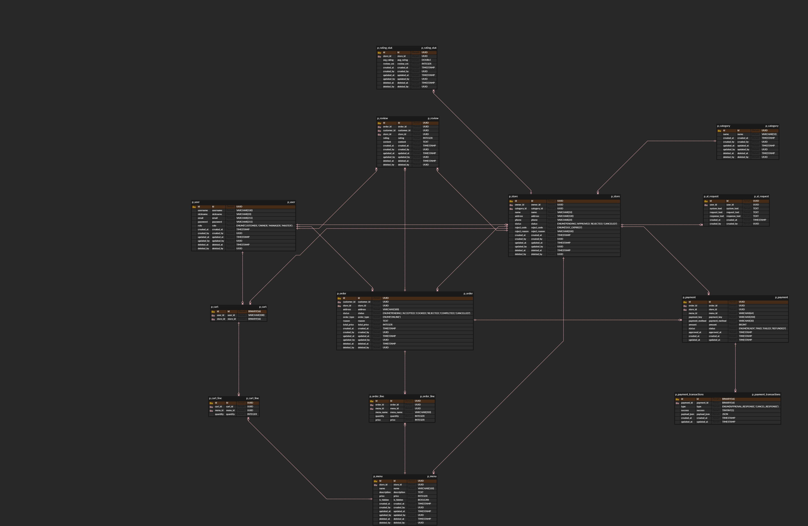

# passion-delivery

음식점 정보 등록부터 주문·결제·리뷰까지 이어지는 배달 주문 관리 플랫폼 백엔드 서버입니다.

## 팀원 역할분담

| 이름  | 담당 도메인  |
|-----|---------|
| 백상은 | 결제      |
| 안정후 | 인증 / 인가 |
| 이준우 | 리뷰      |
| 이현규 | 가게, 메뉴  |
| 이혜인 | 주문      |

## 프로젝트 목적/상세

음식점 사장님(`OWNER`)이 가게와 메뉴를 등록하고, 고객(`CUSTOMER`)이 주문·결제·리뷰를 남기는 흐름을 처리하는 REST API 서버입니다.

**주요 흐름**

```
고객 주문 요청 → 사장님 수락/거절 → 조리 완료 → 배달 중 → 배달 완료
```

배달 라이더는 별도로 존재하지 않으며, 배달 상태 전환을 포함한 모든 주문 처리는 사장님이 담당합니다.

**권한 구조**

| 역할         | 설명                    |
|------------|-----------------------|
| `CUSTOMER` | 주문, 결제, 리뷰 작성         |
| `OWNER`    | 가게·메뉴 관리, 주문 상태 처리    |
| `MANAGER`  | 전체 가게·주문 관리           |
| `MASTER`   | 최고 관리자, MANAGER 계정 관리 |

**주요 기능**

- JWT 기반 인증 / 요청마다 DB 권한 재검증
- 가게 카테고리 분류 (한식·중식·분식·치킨·피자)
- Gemini API 연동 — 메뉴 설명 자동 생성
- 주문 생성 후 5분 이내 취소 가능
- 카드 결제 내역 저장
- 리뷰 및 평점(1–5점) / 가게별 평점 평균 집계
- 전 도메인 Soft Delete 및 Audit 필드 관리

## 서비스 구성 및 실행 방법

Docker와 Docker Compose가 설치되어 있어야 합니다.

**1. 환경변수 설정**

프로젝트 루트에 `.env` 파일을 생성합니다.

```env
DB_URL=jdbc:postgresql://db:5432/pdelivery
DB_USERNAME=pdelivery
DB_PASSWORD=pdelivery
GENAI_API_KEY=<Google AI Studio API 키>
JWT_SECRET=<32자 이상의 임의 문자열>
```

**2. 실행**

```bash
docker compose up --build
```

서버는 기본적으로 `http://localhost:8081` 에서 실행됩니다.

포트를 변경하려면 `.env`에 아래 항목을 추가합니다.

```env
LOCAL_TEST_APP_PORT=8080   # 앱 포트 (기본 8081)
LOCAL_TEST_DB_PORT=5432    # DB 포트 (기본 5432)
```

**3. 초기 관리자 계정**

서버 최초 실행 시 `MASTER` 계정이 자동으로 생성됩니다.

| 항목       | 기본값           |
|----------|---------------|
| username | `master`      |
| password | `Master1234!` |

`.env`에서 `MASTER_USERNAME`, `MASTER_PASSWORD`, `MASTER_NICKNAME`, `MASTER_EMAIL`로 재정의할 수 있습니다.

## ERD



> 인터랙티브 버전: [ERDCloud](https://www.erdcloud.com/d/xevoHpovyZTMh2Lfh)

## 🛠 기술 스택

| 구분                 | 기술                                                              |
|--------------------|-----------------------------------------------------------------|
| **Backend**        | Spring Boot 3.5.4 · Java 17 · Spring Data JPA · Spring Security |
| **Database**       | PostgreSQL 16                                                   |
| **Infrastructure** | Docker                                                          |
| **Testing**        | JUnit 5 · Mockito                                               |
| **빌드 도구**          | Gradle                                                          |
| **AI**             | Google Gemini API (Spring AI)                                   |
